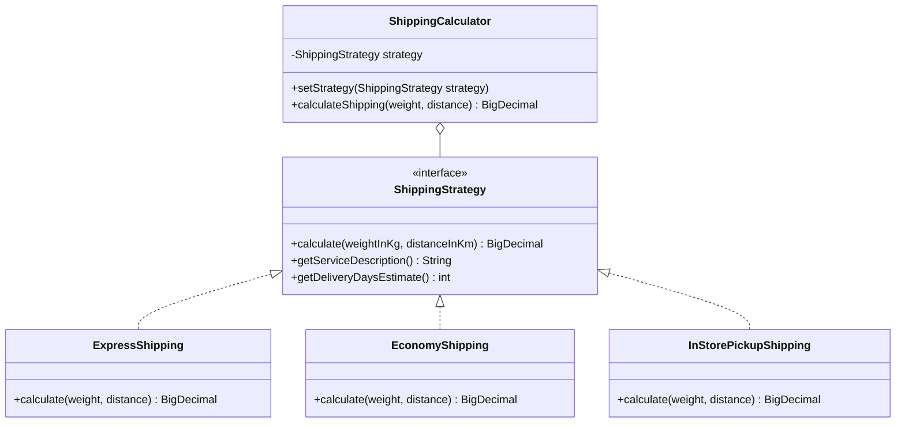
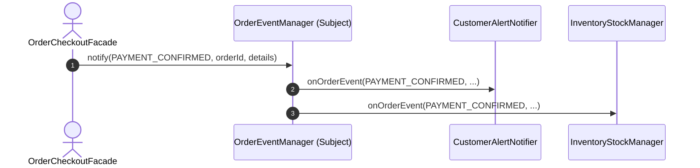

<div align="center">
  <h1>☕ Desafio: Padrões de Projeto GoF em Java Puro</h1>
  <p><strong>Implementação prática, modular e idiomática dos principais padrões de projeto da Gang of Four (GoF)</strong></p>
  <p>
    
    
    
    
  </p>
</div>

---

## 🎯 Sobre o Projeto

Este repositório foi desenvolvido para consolidar os conceitos de **Design Patterns (Padrões de Projeto)** apresentados no Bootcamp da **DIO (Digital Innovation One)**.

Em vez de focar apenas em teoria, o projeto constrói um **ecossistema de E-commerce realista**, integrando **5 dos padrões GoF mais utilizados na indústria de software**, demonstrando como desacoplar código, evitar duplicação e aplicar os princípios **SOLID**.

---

## 🏛️ Padrões GoF Implementados

| Categoria | Padrão | Cenário Prático | Implementação |
| :--- | :--- | :--- | :--- |
| **Criacional** | **Singleton** | Gerenciador de Configurações e Tema Visual | `ConfigurationManager` (Lazy Holder Thread-Safe) e `AppTheme` (Enum) |
| **Criacional** | **Factory Method** | Despacho desacoplado de Notificações | `NotificationFactory` (`EmailNotification`, `SmsNotification`, `PushNotification`) |
| **Comportamental** | **Strategy** | Motor dinâmico de Cálculo de Frete | `ShippingStrategy` (`ExpressShipping`, `EconomyShipping`, `InStorePickupShipping`) |
| **Comportamental** | **Observer** | Barramento de eventos de pedidos | `OrderEventManager` (`CustomerAlertNotifier`, `InventoryStockManager`) |
| **Estrutural** | **Facade** | Checkout unificado de e-commerce | `OrderCheckoutFacade` (orquestrando todos os subsistemas) |

---

## 📐 Arquitetura e Diagramas

### 1. Padrão Facade (Orquestração do Checkout)
O padrão **Facade** fornece uma interface simples para subsistemas com interações complexas:

```mermaid
graph TD
    Client([Cliente / Main]) -->|checkout(...) | Facade[OrderCheckoutFacade]
    
    subgraph Subsistemas
        Facade --> CustomerService[CustomerService]
        Facade --> ShippingCalc[ShippingCalculator]
        Facade --> PaymentGateway[PaymentGateway]
        Facade --> LogisticsService[LogisticsService]
        Facade --> OrderEvents[OrderEventManager]
        Facade --> NotificationFactory[NotificationFactory]
    end
```

### 2. Padrão Strategy (Cálculo de Frete)
Permite alternar o algoritmo de envio em tempo de execução sem modificar a classe cliente:



### 3. Padrão Observer (Barramento de Eventos de Pedido)
Quando um pedido muda de status (ex: `PAYMENT_CONFIRMED` ou `ORDER_SHIPPED`), todos os interessados são notificados de forma desacoplada:



---

## 📁 Estrutura do Projeto

```
d:/projects/java_projects/java_design_patterns_gOf/
├── src/
│   └── com/
│       └── gfb/
│           └── designpatterns/
│               ├── Main.java                                  # Ponto de entrada com demonstração completa
│               ├── creational/
│               │   ├── singleton/
│               │   │   ├── ConfigurationManager.java          # Lazy Holder Thread-Safe
│               │   │   └── AppTheme.java                      # Enum Singleton (Effective Java)
│               │   └── factory/
│               │       ├── Notification.java                  # Interface do Produto
│               │       ├── EmailNotification.java
│               │       ├── SmsNotification.java
│               │       ├── PushNotification.java
│               │       └── NotificationFactory.java           # Creator / Factory Method
│               ├── behavioral/
│               │   ├── strategy/
│               │   │   ├── ShippingStrategy.java              # Interface Strategy
│               │   │   ├── ExpressShipping.java               # Estratégia Aérea/Rápida
│               │   │   ├── EconomyShipping.java               # Estratégia Rodoviária
│               │   │   ├── InStorePickupShipping.java         # Retirada em Loja
│               │   │   └── ShippingCalculator.java            # Contexto do Strategy
│               │   └── observer/
│               │       ├── OrderEventType.java                # Tipos de eventos suportados
│               │       ├── OrderEventListener.java            # Interface Observer
│               │       ├── OrderEventManager.java             # Subject / Publicador
│               │       ├── CustomerAlertNotifier.java         # Observer de Clientes
│               │       └── InventoryStockManager.java         # Observer de Gestão de Estoque
│               └── structural/
│                   └── facade/
│                       ├── OrderCheckoutFacade.java           # Fachada de Checkout
│                       └── subsystems/
│                           ├── CustomerService.java           # Subsistema de Clientes
│                           ├── PaymentGateway.java            # Subsistema de Pagamento
│                           └── LogisticsService.java          # Subsistema de Despacho
├── build.bat                                                  # Script de compilação em 1 clique (Windows)
├── run.bat                                                    # Script de execução em 1 clique (Windows)
├── .gitignore
└── README.md
```

---

## 🚀 Como Executar

### Pré-requisitos
- **Java JDK 17 ou superior** (Testado no OpenJDK 21 LTS).
- Nenhuma dependência externa ou Maven/Gradle é necessária, permitindo execução 100% nativa.

### Executando no Windows (Scripts prontos)
1. **Compilar**:
   Dê um duplo clique em `build.bat` ou execute no terminal:
   ```cmd
   .\build.bat
   ```
2. **Executar**:
   Dê um duplo clique em `run.bat` ou execute no terminal:
   ```cmd
   .\run.bat
   ```

### Executando Manualmente via Terminal
```bash
# 1. Criar pasta de saída
mkdir bin

# 2. Compilar todas as classes
javac -encoding UTF-8 -d bin $(find src -name "*.java") # Linux/Mac
# No PowerShell (Windows):
powershell -Command "$files = (Get-ChildItem -Recurse -Filter *.java src).FullName; javac -encoding UTF-8 -d bin $files"

# 3. Executar
java -cp bin com.gfb.designpatterns.Main
```

---

## 🧪 Demonstração da Saída

Ao rodar a aplicação, você verá uma execução organizada por seções:

```text
================================================================================
          EXPLORANDO PADRÕES DE PROJETO GOF (GANG OF FOUR) EM JAVA PURO          
                 Projeto Prático para Consolidação & Portfólio                  
================================================================================

--------------------------------------------------------------------------------
 1. PADRÃO CRIACIONAL: SINGLETON (Lazy Holder & Enum)
--------------------------------------------------------------------------------
• Teste 1.1: ConfigurationManager (Lazy Holder - Thread Safe)
  Config 1 HashCode: 925858445
  Config 2 HashCode: 925858445
  -> As instâncias são rigorosamente idênticas? true
  -> Valor lido através de config2: "Bem-vindo ao Lab de Design Patterns!"

• Teste 1.2: AppTheme (Enum Singleton)
  [Tema Ativo] Dark Mode (Fundo: #1E1E2E, Texto: #CDD6F4)

--------------------------------------------------------------------------------
 2. PADRÃO CRIACIONAL: FACTORY METHOD (Notification Factory)
--------------------------------------------------------------------------------
• Criando e despachando diferentes tipos de notificações dinamicamente:
  [EMAIL] Enviando para <usuario@empresa.com>: "Seu relatório mensal de vendas está disponível."
  [SMS] Enviando para telefone <+55 11 99999-8888>: "Código de verificação 2FA: 482-910."
  [PUSH] Disparando alerta Push para o dispositivo <device-token-xyz-123>: "Você recebeu um novo cupom de desconto de 20%!"

--------------------------------------------------------------------------------
 3. PADRÃO COMPORTAMENTAL: STRATEGY (Cálculo Dinâmico de Frete)
--------------------------------------------------------------------------------
• Simulando cálculo para carga de 2,5 kg e distância de 120,0 km:
  -> Frete Econômico (Padrão Rodoviário)      | Prazo: 5 dia(s) | Custo: R$ 28,90
  -> Frete Expresso (Entrega Aérea / Rápida)  | Prazo: 1 dia(s) | Custo: R$ 78,25
  -> Retirada na Loja Física (Sem Custo de Envio) | Prazo: 0 dia(s) | Custo: R$ 0,00

--------------------------------------------------------------------------------
 4. PADRÃO COMPORTAMENTAL: OBSERVER (Barramento de Eventos de Pedido)
--------------------------------------------------------------------------------
• Disparando Evento: PAYMENT_CONFIRMED para Pedido #9001:
    -> [OBSERVER: Cliente (alice@tech.io)] Pedido #9001 atualizado: [PAYMENT_CONFIRMED] - Pagamento de R$ 350.00 confirmado via PIX.
    -> [OBSERVER: Estoque] Pedido #9001 aprovado. Reservando itens e gerando ordem de separação no armazém.

--------------------------------------------------------------------------------
 5. PADRÃO ESTRUTURAL: FACADE (Checkout Unificado Integrando Todos os Padrões)
--------------------------------------------------------------------------------

=== [FACADE] Iniciando Processo de Checkout Simplificado (Pedido ORD-739E17) ===
  [Subsistema Cliente] Localizando dados cadastrais para ID: CUST-1001...
  [Estratégia Frete] Frete Expresso (Entrega Aérea / Rápida) -> Custo: R$ 69,15 (Estimativa: 1 dias)
  [Subsistema Pagamento] Processando R$ 569,05 via CREDIT_CARD para o cliente CUST-1001...
    -> [OBSERVER: Cliente (dev.senior@example.com)] Pedido #ORD-739E17 atualizado: [PAYMENT_CONFIRMED] - Valor pago: R$ 569.05
    -> [OBSERVER: Estoque] Pedido #ORD-739E17 aprovado. Reservando itens e gerando ordem de separação no armazém.
  [Subsistema Logística] Gerando etiqueta de envio para Pedido #ORD-739E17 (Destino: São Paulo - SP - CEP 01310-100)...
    -> [OBSERVER: Cliente (dev.senior@example.com)] Pedido #ORD-739E17 atualizado: [ORDER_SHIPPED] - Rastreio: BR-CDA24393
  [EMAIL] Enviando para <dev.senior@example.com>: "Seu pedido #ORD-739E17 foi aprovado e despachado! Código de Rastreio: BR-CDA24393"
  [Sistema] Concluído sob a versão: 1.0.0 (production)
```

---

## 💡 Principais Aprendizados e Boas Práticas

- **Princípio da Responsabilidade Única (SRP)**: Cada subsistema, estratégia e observer possui uma única razão para mudar.
- **Princípio Aberto/Fechado (OCP)**: Novos canais de notificação ou estratégias de frete podem ser adicionados sem alterar o código existente.
- **Thread Safety sem overhead**: Implementação do Singleton via *Bill Pugh Lazy Holder*.
- **Desacoplamento via Interfaces**: O cliente do frete interage apenas com a interface `ShippingStrategy`, permitindo flexibilidade total.
